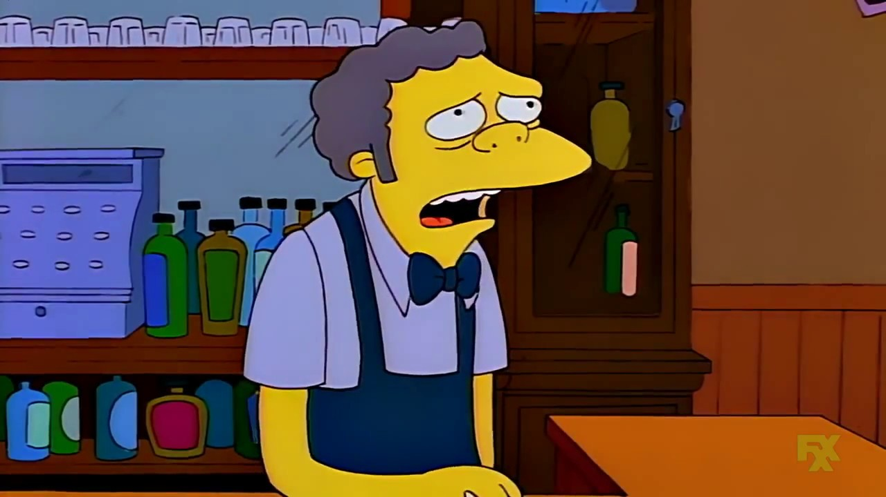

# TV scripts generation

Generation of tv scripts using recurrent neural networks, embeedings e word2vec algorithms, based on part of the Simpsons dataset of scripts from 27 seasons. 

The Neural Network you'll build will generate a new TV script for a scene at Moe's Tavern.
